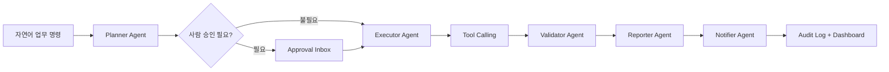

# IWAP: 지능형 업무 자동화 플랫폼

IWAP(Intelligent Workflow Automation Platform)는 자연어 업무 요청을 다중 에이전트 워크플로로 변환하는 B2B AI 자동화 플랫폼 데모입니다. 보고서 생성, 고객 관리 기록, 알림 발송, 승인 요청, 감사 로그까지 하나의 흐름으로 보여주는 포트폴리오/제안용 프로젝트입니다.

> 이력서 요약: Spring Boot, Spring AI, Next.js, PostgreSQL, PGVector, WebSocket 진행 스트리밍, Tool Calling, Human-in-the-loop 승인, 감사 로그를 포함한 하이브리드 SaaS/SI형 AI 자동화 플랫폼을 구축했습니다.

## 왜 필요한가

중소기업과 현업 팀은 단순 챗봇보다 “반복 업무가 실제로 끝나는 자동화”를 원합니다. IWAP은 자연어 명령을 받아 기존 업무 도구와 연결될 수 있는 워크플로 구조를 보여줍니다.

- 월간 매출 보고서를 만들고 Slack과 Email로 공유합니다.
- 신규 고객 온보딩 시 고객 관리 기록, 환영 이메일, 담당자 알림을 처리합니다.
- 재고 부족 품목을 찾아 구매팀 알림 전 사람 승인을 요청합니다.
- 주간 영업 실적을 분석해 PDF/Markdown 리포트 산출물로 정리합니다.

## 제품 데모 흐름



## 아키텍처

```text
backend/
  domain/            워크플로, 에이전트, 툴, 승인, 감사, 메모리 도메인 모델
  application/       워크플로 유스케이스와 오케스트레이션 정책
  infrastructure/    영속성, AI provider, 커넥터, WebSocket, 보안
  interfaces/        REST API, WebSocket, DTO

frontend/
  app/               Next.js App Router
  components/        Command Center, Timeline, Dashboard UI
  lib/               데모 계약과 샘플 데이터
```

## 기술 스택

- Spring Boot 3.4.x, Java 21, Spring AI
- PostgreSQL 16, PGVector, Flyway
- REST API, Swagger/OpenAPI, WebSocket/STOMP
- Next.js 16, TypeScript, Tailwind CSS, TanStack Query
- Docker Compose

## 디자인 방향

IWAP은 따뜻한 엔터프라이즈 콘솔 스타일을 지향합니다. 크림색 캔버스, 절제된 코랄 액션 컬러, 어두운 실행 로그 패널을 사용해 일반 SaaS 대시보드보다 더 시연 친화적이고 설명하기 쉬운 톤을 만듭니다.

자세한 UI 기준은 [docs/design-system.md](</D:/work/iwap/docs/design-system.md>)에 정리되어 있습니다.

## 데모 시나리오

1. “이번 달 매출 보고서 만들어서 슬랙 채널과 이메일로 보내줘”
2. “신규 고객 등록 후 환영 이메일 보내고, 고객 관리 시스템에 기록하고, 담당자에게 알림”
3. “재고 부족 제품 리스트 뽑아서 구매팀 카카오톡으로 보내”
4. “주간 영업 실적 분석해서 PDF 리포트 생성 후 공유”

상세 시나리오는 [docs/demo-scenarios.md](</D:/work/iwap/docs/demo-scenarios.md>)에 있습니다.

## 현재 구현 범위

현재 버전은 배포 가능한 포트폴리오 데모 스캐폴드입니다.

- 자연어 명령 기반 워크플로 실행 API
- 월간 매출 보고서 완료 플로우
- 신규 고객 온보딩 완료 플로우
- 재고 부족 승인 대기 플로우
- 주간 영업 리포트 완료 플로우
- Demo JWT 로그인과 상태 변경 API 보호
- 승인/반려 API와 중복 결정 방지
- 프론트엔드 Command Center에서 백엔드 API 호출
- 워크플로, 이벤트, 툴 호출, 승인 요청, 감사 로그, 메모리 DB 스키마
- PGVector 기반 메모리 테이블 준비
- Docker Compose 기반 로컬 실행
- 배포 전 테스트 시나리오와 seed 데이터

아직 실제 외부 발송은 mock/demo 구조입니다. Slack, Email, KakaoWork, CRM, ERP는 adapter boundary와 데모용 tool call 이력으로 표현되어 있고, 실제 vendor API 호출은 다음 단계에서 붙일 수 있습니다.

## 로컬 실행

프로젝트 위치:

```powershell
D:\work\iwap
```

실행:

```powershell
docker compose up -d --build
```

서비스 주소:

- Frontend: `http://localhost:3000`
- Backend API: `http://localhost:8080`
- Swagger UI: `http://localhost:8080/swagger-ui.html`
- Health: `http://localhost:8080/api/health`
- PostgreSQL: `localhost:5432`

## 환경 변수

기본 데모 실행에는 API 키가 필요하지 않습니다. `.env.example`은 mock 모드 기준으로 구성되어 있습니다.

주요 값:

- `IWAP_FRONTEND_PORT=3000`
- `IWAP_BACKEND_PORT=8080`
- `IWAP_POSTGRES_PORT=5432`
- `IWAP_AI_PROVIDER=mock`
- `IWAP_INTEGRATION_MODE=mock`
- `IWAP_ALLOWED_ORIGINS=http://localhost:3000`
- `NEXT_PUBLIC_IWAP_API_BASE_URL=http://localhost:8080`
- `NEXT_PUBLIC_IWAP_WS_URL=http://localhost:8080/ws/workflows`

실제 외부 연동을 추가할 때 필요한 후보:

- `OPENAI_API_KEY`
- `SLACK_BOT_TOKEN`
- `SLACK_DEFAULT_CHANNEL`
- `SMTP_HOST`
- `SMTP_PORT`
- `SMTP_USERNAME`
- `SMTP_PASSWORD`

## 샘플 데이터

샘플 CSV는 아래 위치에 있습니다.

```text
backend/src/main/resources/samples/
```

포함된 파일:

- `sales-data.csv`: 월간 매출 보고서용 채널별 매출 데이터
- `inventory.csv`: 재고 부족 알림용 SKU/재고/공급사 데이터
- `customers.csv`: 신규 고객 온보딩용 고객 데이터
- `weekly-sales-activities.csv`: 주간 영업 리포트용 활동/계약 데이터

현재 구현은 CSV를 실제로 계산에 사용하기보다는, 해당 데이터 소스를 읽는 tool call 흐름을 데모 응답과 문서로 보여주는 단계입니다.

## 테스트 데이터 적재

배포 전 리허설용 seed SQL:

```text
backend/src/main/resources/db/seed/demo-test-data.sql
```

실행:

```powershell
Get-Content -Encoding UTF8 backend/src/main/resources/db/seed/demo-test-data.sql |
  docker compose exec -T postgres psql -U iwap -d iwap
```

적재되는 데이터:

- `workflow_runs`: 4건
- `workflow_events`: 16건
- `tool_calls`: 12건
- `approval_requests`: 1건
- `audit_logs`: 11건
- `workflow_memories`: 4건

자세한 테스트 절차는 [docs/test-scenarios.md](</D:/work/iwap/docs/test-scenarios.md>)에 있습니다.

## API 예시

보호된 상태 변경 API는 Demo Login으로 받은 Bearer token이 필요합니다.

월간 매출 보고서 실행:

```powershell
@'
const login = await fetch('http://localhost:8080/api/auth/demo-login', {
  method: 'POST',
  headers: {'content-type': 'application/json; charset=utf-8'},
  body: JSON.stringify({ role: 'MANAGER' })
});
const { accessToken } = await login.json();

const res = await fetch('http://localhost:8080/api/workflows/runs', {
  method: 'POST',
  headers: {
    'content-type': 'application/json; charset=utf-8',
    authorization: `Bearer ${accessToken}`
  },
  body: JSON.stringify({
    command: '이번 달 매출 보고서 만들어서 슬랙 채널과 이메일로 보내줘',
    scenarioKey: 'monthly-sales-report',
    requestedBy: 'manager@demo-company.com'
  })
});
console.log(JSON.stringify(await res.json(), null, 2));
'@ | node --input-type=module
```

재고 부족 승인 대기 실행:

```powershell
@'
const login = await fetch('http://localhost:8080/api/auth/demo-login', {
  method: 'POST',
  headers: {'content-type': 'application/json; charset=utf-8'},
  body: JSON.stringify({ role: 'MANAGER' })
});
const { accessToken } = await login.json();

const res = await fetch('http://localhost:8080/api/workflows/runs', {
  method: 'POST',
  headers: {
    'content-type': 'application/json; charset=utf-8',
    authorization: `Bearer ${accessToken}`
  },
  body: JSON.stringify({
    command: '재고 부족 제품 리스트 뽑아서 구매팀 카카오톡으로 보내',
    scenarioKey: 'low-inventory',
    requestedBy: 'operator@demo-company.com'
  })
});
console.log(JSON.stringify(await res.json(), null, 2));
'@ | node --input-type=module
```

## 배포 전 체크

Backend:

```powershell
cd backend
mvn test
mvn package
```

호스트에 Maven이 없으면 Docker로 같은 검증을 실행합니다.

```powershell
docker run --rm -v D:\work\iwap\backend:/workspace -w /workspace maven:3.9.9-eclipse-temurin-21 mvn test
```

Frontend:

```powershell
cd frontend
npm ci
npm audit --audit-level=moderate
npm run lint
npm run typecheck
npm run build
```

Docker:

```powershell
docker compose build
docker compose up -d --force-recreate
docker compose ps
```

Smoke test:

```powershell
Invoke-RestMethod http://localhost:8080/api/health
Invoke-WebRequest http://localhost:3000 -UseBasicParsing
docker compose exec -T postgres psql -U iwap -d iwap -c "SELECT status, count(*) FROM workflow_runs GROUP BY status ORDER BY status;"
```

## 현재 주의할 점

- `GET /api/workflows/runs`는 현재 서버 메모리 저장소 기준의 실행 이력을 반환합니다. 컨테이너 재시작 후에도 유지되는 영속 히스토리 화면은 다음 단계 범위입니다.
- 승인/반려 API는 구현되어 있으며, 이미 승인 또는 반려된 요청을 다시 처리하면 `409 Conflict`를 반환합니다.
- 워크플로 생성, 승인, 반려 같은 상태 변경 API는 Demo JWT 인증이 필요합니다.
- Slack, Email, KakaoWork, CRM은 실제 외부 API 호출이 아니라 mock/demo adapter 스토리입니다.
- OpenAI API 키 없이도 데모는 동작합니다.

## 엔터프라이즈 연동 방향

IWAP은 adapter 기반으로 확장할 수 있게 설계되어 있습니다.

- ERP, CRM, 그룹웨어, 커머스 시스템용 REST API adapter
- 매출/재고/고객 데이터를 읽는 DB View adapter
- 엑셀/CSV 중심 업무를 위한 파일 adapter
- 이벤트 기반 자동화를 위한 Webhook adapter
- 안정적인 포트폴리오 시연을 위한 Mock provider

## 문서

- [docs/architecture.md](</D:/work/iwap/docs/architecture.md>)
- [docs/api-contract.md](</D:/work/iwap/docs/api-contract.md>)
- [docs/database-erd.md](</D:/work/iwap/docs/database-erd.md>)
- [docs/demo-scenarios.md](</D:/work/iwap/docs/demo-scenarios.md>)
- [docs/test-scenarios.md](</D:/work/iwap/docs/test-scenarios.md>)
- [docs/business-impact.md](</D:/work/iwap/docs/business-impact.md>)
- [docs/technical-decisions.md](</D:/work/iwap/docs/technical-decisions.md>)
- [docs/security-and-operations.md](</D:/work/iwap/docs/security-and-operations.md>)
- [docs/design-system.md](</D:/work/iwap/docs/design-system.md>)

## 2026-05-14 수정 내역

최근 코드 리뷰에서 확인한 Docker, 보안, 배포, 실시간 이벤트, 표시 문자열 문제를 다음과 같이 정리했습니다.

- JWT 인증 필터를 Spring Security 체인에 실제 등록하고, 워크플로 생성/승인/거절 같은 상태 변경 API는 인증이 필요하도록 변경했습니다.
- 승인 요청은 `PENDING` 상태에서만 승인 또는 반려할 수 있게 막고, 이미 처리된 승인 요청을 다시 변경하면 `409 Conflict`를 반환하도록 했습니다.
- 워크플로 실행 ID에 UUID 접미사를 붙여 같은 초에 같은 시나리오를 여러 번 실행해도 ID가 충돌하지 않게 했습니다.
- 워크플로 이벤트를 WebSocket/STOMP 토픽으로 발행하고, 프론트 타임라인이 실제 이벤트를 구독하도록 연결했습니다.
- WebSocket origin 허용값의 `*` 설정을 제거하고 REST CORS와 같은 origin pattern 설정을 사용하도록 제한했습니다.
- Render 배포 설정의 DB/CORS 환경변수 이름을 애플리케이션 설정과 맞췄고, `IWAP_DATABASE_HOST/PORT/NAME`만 있어도 JDBC URL이 조합되도록 했습니다.
- 깨진 `demo-test-data.sql` seed 파일을 실행 가능한 데이터로 교체하고, `psql -v ON_ERROR_STOP=1`로 커밋까지 검증했습니다.
- 백엔드 Docker 이미지 빌드에서 테스트를 건너뛰지 않도록 `mvn package`가 테스트를 함께 실행하게 변경했습니다.
- 프론트 주요 화면과 백엔드 데모 시나리오 API의 깨진 한글 표시 문자열을 정상 한국어로 정리했습니다.

검증한 명령:

```powershell
docker run --rm -v ${PWD}:/workspace -w /workspace maven:3.9.9-eclipse-temurin-21 mvn test
npm run typecheck
npm run lint
docker compose build backend frontend
docker compose up -d
Get-Content backend/src/main/resources/db/seed/demo-test-data.sql |
  docker compose exec -T postgres psql -U iwap -d iwap -v ON_ERROR_STOP=1
curl.exe -s http://localhost:8080/api/demo-scenarios
curl.exe -I http://localhost:3000
```

확인 결과:

- 백엔드 테스트 12개 통과
- 프론트 타입체크, 린트, Docker build 통과
- 미인증 워크플로 POST는 `401`로 차단
- demo-login 후 워크플로 POST는 정상 생성
- 데모 시나리오 API와 프론트 첫 화면에서 정상 한국어 렌더 확인
