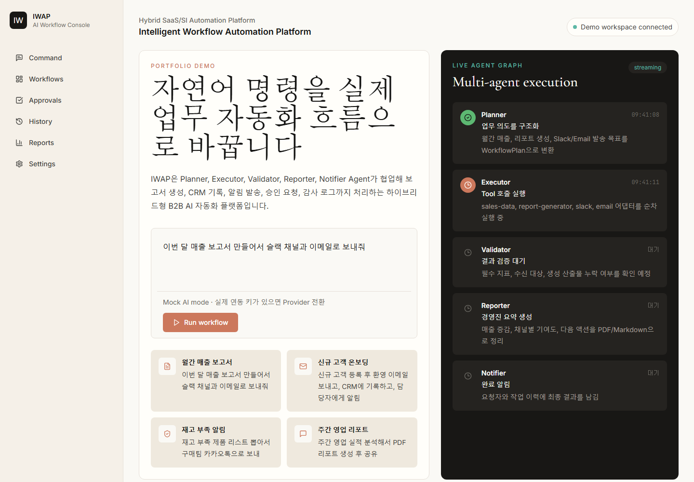
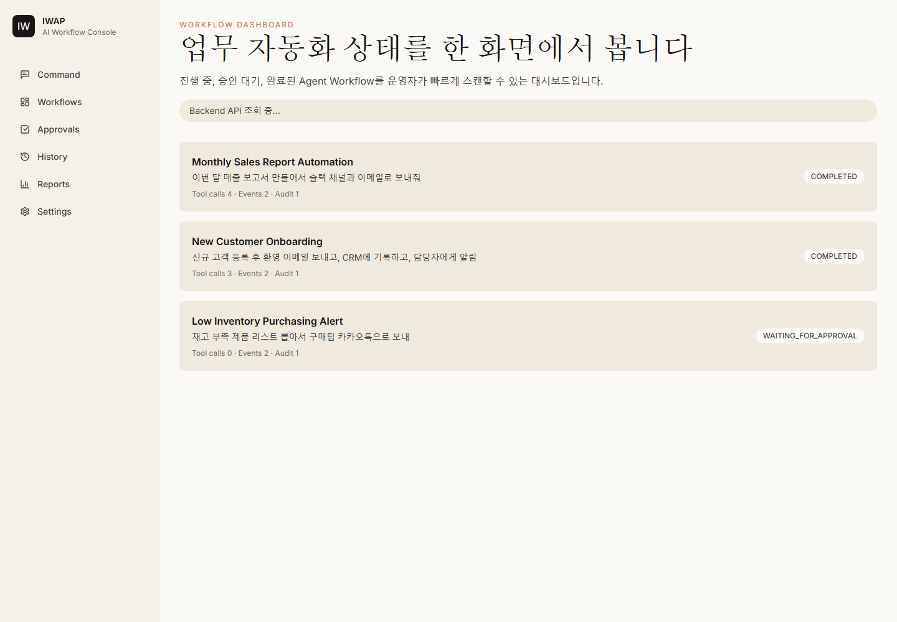
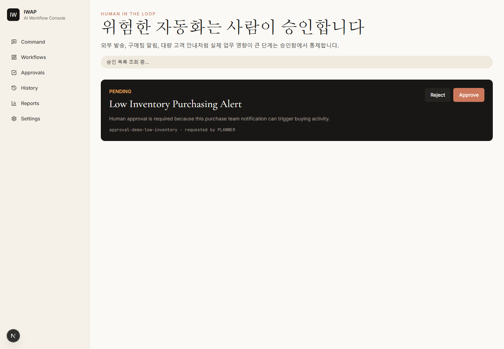
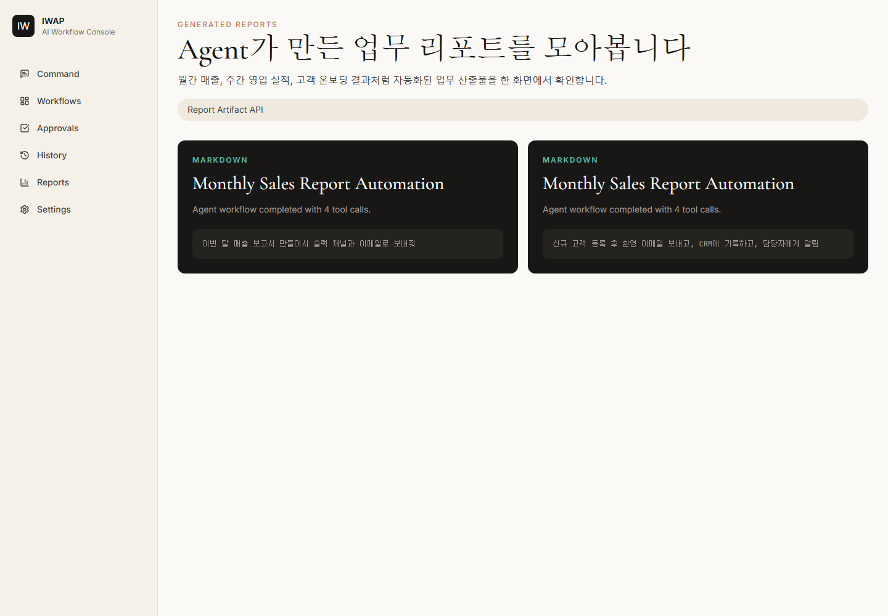
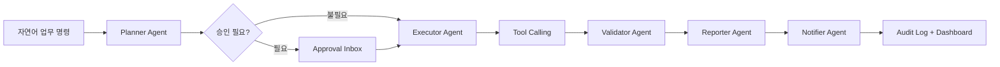

# IWAP - Intelligent Workflow Automation Platform

IWAP는 중소기업과 스타트업에서 반복적으로 발생하는 업무를 자연어 명령 기반의 Multi-Agent Workflow로 실행하는 포트폴리오용 B2B AI 업무 자동화 플랫폼입니다.

단순 챗봇이 아니라 Planner, Executor, Validator, Reporter, Notifier Agent가 업무를 나누어 처리하고, Tool Calling, Human-in-the-Loop 승인, 감사 로그, 리포트 산출물, WebSocket 실시간 이벤트까지 한 흐름으로 보여주는 데 초점을 맞췄습니다.

## 프로젝트 목적

기업 고객에게 필요한 것은 "답변"보다 "실행 가능한 업무 흐름"인 경우가 많습니다. IWAP는 다음과 같은 업무 자동화 시나리오를 데모합니다.

- 월간 매출 보고서 생성 후 Slack/Email 공유
- 신규 고객 등록, 환영 이메일 발송, CRM 기록, 담당자 알림
- 재고 부족 상품 분석 후 구매팀 알림 요청
- 주간 영업 실적 분석 및 Markdown/PDF 리포트 생성
- 구매, 외부 발송 등 영향도가 있는 작업의 승인 후 실행
- Agent 단계, Tool 호출, 승인, 산출물, 감사 로그 추적

## 데모 화면

스크린샷은 `docs/assets/screenshots`에 저장됩니다.






## 핵심 흐름



## 주요 기능

- Multi-Agent workflow orchestration
- Tool Calling adapter 구조
- Human-in-the-Loop 승인함
- Audit Log와 Report Artifact
- PostgreSQL/JPA 기반 workflow persistence
- WebSocket/STOMP 기반 실시간 workflow event 발행
- 백엔드 미실행 시에도 포트폴리오 화면을 볼 수 있는 demo fallback
- Docker Compose 기반 로컬 실행 구성
- GitHub Actions CI: backend test, frontend build, Docker build

## 기술 스택

| 영역 | 기술 |
| --- | --- |
| Backend | Java 21, Spring Boot 3.4, Spring AI, Spring Security, WebSocket/STOMP |
| Frontend | Next.js 15, React 19, TypeScript, Tailwind CSS, TanStack Query |
| Database | PostgreSQL 16, PGVector, Flyway |
| Infra | Docker Compose, GitHub Actions |
| Architecture | Clean Architecture, Adapter Pattern, Multi-Agent Orchestration |

## 프로젝트 구조

```text
backend/
  src/main/java/com/iwap
    domain/            Workflow, Agent, Tool, Approval, Audit, Report 모델
    application/       Agent orchestration, workflow use case, tool registry
    infrastructure/    WebSocket, OpenAPI, CORS, security, mock tool adapters
    interfaces/        REST API controllers and DTOs

frontend/
  app/                 Next.js App Router pages
  components/          Command Center, dashboard, timeline, shell UI
  lib/                 API client, demo fallback, WebSocket event client

docs/
  architecture.md
  api-contract.md
  deployment.md
  local-dev-checklist.md
  portfolio-summary.md
```

## 실행 방법

### Docker Compose

```powershell
copy .env.example .env
docker compose up --build
```

서비스 주소:

- Frontend: `http://localhost:3000`
- Backend API: `http://localhost:8080`
- Swagger UI: `http://localhost:8080/swagger-ui.html`
- Health Check: `http://localhost:8080/api/health`

### Frontend 단독 실행

```powershell
cd frontend
npm install
npm run typecheck
npm run build
npm run dev
```

프론트엔드는 먼저 Backend API를 호출하고, 백엔드가 실행 중이 아니면 demo fallback 데이터를 표시합니다.

## API 예시

### Workflow 실행

```bash
curl -X POST http://localhost:8080/api/workflows/runs \
  -H "Content-Type: application/json" \
  -d "{\"command\":\"이번 달 매출 보고서를 만들어서 슬랙 채널과 이메일로 보내줘\",\"scenarioKey\":\"monthly-sales-report\",\"requestedBy\":\"manager@demo-company.com\"}"
```

### 승인 목록 조회

```bash
curl http://localhost:8080/api/approvals
```

### 감사 로그 조회

```bash
curl http://localhost:8080/api/audit-logs
```

### Tool Adapter 조회

```bash
curl http://localhost:8080/api/tools
```

## 현재 검증 상태

- Frontend `npm run typecheck` 통과
- Frontend `npm run build` 통과
- Frontend `npm audit --audit-level=high` 통과
- GitHub Actions에서 Backend Maven Test 통과
- GitHub Actions에서 Frontend Build 통과
- GitHub Actions에서 Docker Build 통과
- 로컬 Docker Desktop에서 `docker compose up --build -d` 통과
- 로컬 Docker Compose 기준 Postgres, Backend, Frontend health check 통과
- 로컬 Docker 환경에서 workflow 실행 API가 `COMPLETED` 응답을 반환하는 것까지 확인
- Backend 재시작 후 workflow history와 approval decision 상태가 PostgreSQL에서 복원되는 것 확인

## 포트폴리오 포인트

- "AI 채팅"이 아니라 실제 업무 실행 흐름을 설계한 프로젝트
- 기존 ERP, CRM, 그룹웨어, CSV/Excel, Webhook 연동으로 확장 가능한 Adapter 구조
- 승인, 감사 로그, 리포트 산출물, DB persistence 등 기업 운영 관점 반영
- Spring Boot + Next.js + Docker 기반의 풀스택 구현
- Mock Provider와 Real Provider 전환을 고려한 데모 친화 구조

## 문서

- [Architecture](docs/architecture.md)
- [API Contract](docs/api-contract.md)
- [Deployment](docs/deployment.md)
- [Local Dev Checklist](docs/local-dev-checklist.md)
- [Portfolio Summary](docs/portfolio-summary.md)
