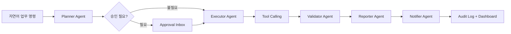

# Intelligent Workflow Automation Platform (IWAP)

IWAP는 중소기업과 스타트업이 실제로 필요로 하는 반복 업무를 **자연어 명령 → Multi-Agent Workflow → Tool 실행 → 승인/검증/보고/감사 로그** 흐름으로 자동화하는 포트폴리오용 B2B AI 업무 자동화 플랫폼입니다.

> 이력서 요약: Spring Boot 3.4, Spring AI, Next.js 15, PostgreSQL, PGVector, WebSocket, Tool Calling, Human-in-the-Loop, Audit Log를 활용해 자연어 업무 지시를 다중 Agent 기반 워크플로우로 실행하는 하이브리드형 AI 업무 자동화 플랫폼을 설계/구현했습니다.

## 프로젝트 의도

기업 고객은 단순 챗봇보다 “기존 업무 도구와 연결되어 일을 끝내는 자동화”를 원합니다. IWAP는 이 지점을 포트폴리오에서 명확히 보여주기 위해 만들었습니다.

- 월간 매출 보고서를 생성하고 Slack/Email로 공유
- 신규 고객 등록 후 CRM 기록, 환영 이메일 발송, 담당자 알림
- 재고 부족 제품을 분석하고 구매팀 알림 전송
- 주간 영업 실적을 분석해 PDF/Markdown 리포트 생성
- 외부 발송/구매 관련 작업은 사용자 승인 후 진행
- 모든 Agent 판단과 Tool 호출을 감사 로그로 추적

## 핵심 데모 흐름



## 주요 기능

- **Multi-Agent System**
  - Planner Agent
  - Executor Agent
  - Validator Agent
  - Reporter Agent
  - Notifier Agent

- **Human-in-the-Loop**
  - 구매 요청, 외부 발송, 대량 알림처럼 영향도가 큰 작업은 승인 후 실행

- **Tool Calling 구조**
  - Email, Slack, KakaoWork, CRM, ERP, Google Sheets, CSV/Excel 연동을 Adapter 방식으로 확장
  - 데모 안정성을 위해 Mock Provider 우선 적용
  - 실제 키가 있으면 Real Provider로 교체 가능한 구조

- **운영/감사 기능**
  - Workflow 이력
  - Agent Timeline
  - Tool Call 기록
  - Approval 기록
  - Audit Log

## 아키텍처

```text
backend/
  domain/            Workflow, Agent, Tool, Approval, Audit, Memory 도메인 모델
  application/       Agent orchestration, use case, workflow policy
  infrastructure/    Persistence, AI provider, connector, WebSocket, security adapter
  interfaces/        REST API, WebSocket endpoint, DTO

frontend/
  app/               Next.js App Router
  components/        Command center, Agent timeline, dashboard UI
  lib/               API client, demo fallback, workflow contracts

docs/
  architecture.md
  api-contract.md
  demo-scenarios.md
  business-impact.md
  technical-decisions.md
  security-and-operations.md
  design-system.md
```

## 기술 스택

- Backend: Spring Boot 3.4.x, Java 21, Spring AI
- Database: PostgreSQL 16, PGVector, Flyway
- API: REST API, Swagger/OpenAPI, WebSocket/STOMP
- Frontend: Next.js 15, TypeScript, Tailwind CSS, TanStack Query
- Infra: Docker Compose
- Architecture: Clean Architecture, Adapter Pattern, Agent Orchestration

## 디자인 방향

IWAP는 일반적인 파란색 SaaS 대시보드 대신 **따뜻한 에디토리얼 B2B AI 제품** 톤을 사용합니다.

- 크림색 캔버스
- 절제된 코랄 CTA
- Agent 실행 로그와 Tool Call을 강조하는 다크 패널
- 첫 화면에서 바로 보이는 자연어 명령 입력 + Agent Timeline

전체 디자인 시스템은 `docs/design-system.md`에 정리되어 있습니다.

## 데모 시나리오

1. “이번 달 매출 보고서 만들어서 슬랙 채널과 이메일로 보내줘”
2. “신규 고객 등록 후 환영 이메일 보내고, CRM에 기록하고, 담당자에게 알림”
3. “재고 부족 제품 리스트 뽑아서 구매팀 카카오톡으로 보내”
4. “주간 영업 실적 분석해서 PDF 리포트 생성 후 공유”

## 실행 방법

### 전체 실행

```bash
cp .env.example .env
docker compose up --build
```

### 프론트엔드만 미리보기

```bash
cd frontend
npm install
npm run build
npm start
```

서비스 주소:

- Frontend: `http://localhost:3000`
- Backend API: `http://localhost:8080`
- Swagger UI: `http://localhost:8080/swagger-ui.html`
- Health Check: `http://localhost:8080/api/health`

## 프론트엔드 화면

- `/`: 자연어 명령 Command Center
- `/workflows`: 워크플로우 대시보드
- `/approvals`: Human-in-the-Loop 승인함
- `/history`: Agent 및 Tool Call 감사 이력
- `/demo`: 데모 시나리오 소개
- `/reports`: Agent가 생성한 리포트 산출물
- `/settings`: Mock/Real 연동 설정 화면

프론트엔드는 Backend API를 우선 호출하고, 백엔드가 실행 중이 아니면 데모 fallback 데이터를 표시합니다. 이 구조 덕분에 포트폴리오 시연 중에도 화면이 비어 보이지 않고, 백엔드가 연결되면 같은 UI가 실제 API 결과를 보여줍니다.

## API 예시

### 워크플로우 실행

```bash
curl -X POST http://localhost:8080/api/workflows/runs \
  -H "Content-Type: application/json" \
  -d "{\"command\":\"이번 달 매출 보고서 만들어서 슬랙 채널과 이메일로 보내줘\",\"scenarioKey\":\"monthly-sales-report\",\"requestedBy\":\"manager@demo-company.com\"}"
```

### 승인 목록 조회

```bash
curl http://localhost:8080/api/approvals
```

### 감사 로그 조회

```bash
curl http://localhost:8080/api/audit-logs
```

### 데모 시나리오 목록/시드 생성

```bash
curl http://localhost:8080/api/demo-scenarios

curl -X POST http://localhost:8080/api/demo-scenarios/seed
```

### 등록된 Tool Adapter 조회

```bash
curl http://localhost:8080/api/tools
```

### 승인 처리

```bash
curl -X POST http://localhost:8080/api/approvals/{approvalId}/approve \
  -H "Content-Type: application/json" \
  -d "{\"decidedBy\":\"manager@demo-company.com\"}"
```

## 기존 기업 시스템 연동 전략

IWAP는 특정 외부 서비스에 강하게 묶이지 않고 Adapter 기반으로 설계되었습니다.

- REST API Adapter: ERP, CRM, 그룹웨어, 쇼핑몰 관리자
- Database View Adapter: 매출, 재고, 고객 데이터 읽기 전용 연동
- CSV/Excel Adapter: 엑셀 기반 업무를 유지하는 중소기업 대상
- Webhook Adapter: 고객 등록, 결제 완료, 재고 부족 이벤트 기반 자동 실행
- Mock Provider: 포트폴리오 데모 안정성 확보

실제 기업 환경에서는 Mock Adapter를 고객사의 REST API, DB View, CSV/Excel, Webhook Adapter로 교체해 기존 시스템과 붙일 수 있습니다.

## 포트폴리오 어필 포인트

- “AI 챗봇”이 아니라 실제 업무를 끝내는 Agent Workflow 구조
- SI 고객에게 설명하기 좋은 기존 시스템 연동 전략
- 스타트업/중소기업이 바로 이해할 수 있는 업무 자동화 시나리오
- 승인, 감사 로그, Mock/Real Provider 분리 등 운영 관점 반영
- Spring Boot + Next.js 기반 풀스택 포트폴리오

## 문서

- `docs/architecture.md`
- `docs/api-contract.md`
- `docs/demo-scenarios.md`
- `docs/business-impact.md`
- `docs/technical-decisions.md`
- `docs/security-and-operations.md`
- `docs/design-system.md`
- `docs/portfolio-summary.md`
- `docs/deployment.md`
- `docs/sample-reports/monthly-sales-report.md`
- `docs/local-dev-checklist.md`
