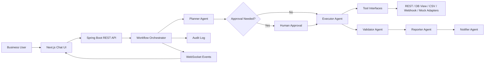

# IWAP Architecture

IWAP uses a hybrid SaaS/SI architecture. The product surface is a modern SaaS dashboard, while the integration layer is intentionally adapter-based so customer-specific systems can be attached without changing agent logic.

## Backend Layers

- `domain`: Pure workflow, agent, tool, approval, audit, and memory concepts.
- `application`: Use cases and orchestration policies. This layer owns the business workflow.
- `infrastructure`: AI providers, persistence, connectors, WebSocket, file/report generation, and security adapters.
- `interfaces`: REST controllers, WebSocket endpoints, and transport DTOs.

## Integration Boundary

External systems are represented as connectors and adapters. Agents call stable tool interfaces; adapters decide whether to use mock data, REST APIs, database views, CSV/Excel files, or webhooks. This makes the demo reliable while keeping the enterprise integration story credible.
