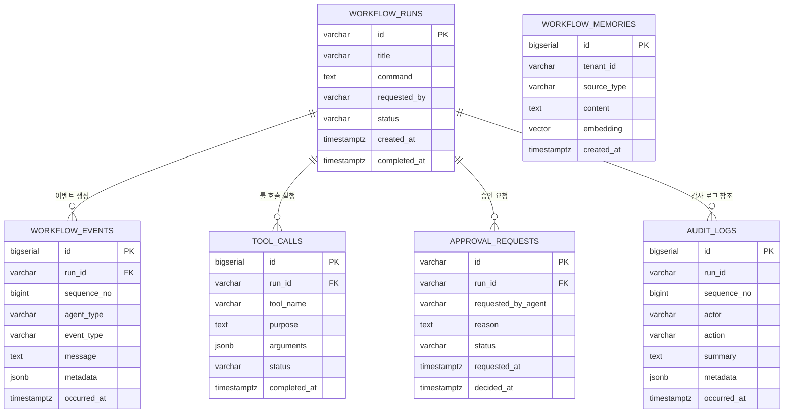

# 데이터베이스 ERD

이 문서는 `backend/src/main/resources/db/migration/V1__create_iwap_core_tables.sql` 기준의 IWAP 초기 데이터베이스 구조를 설명합니다.

## ERD

## 전체 구조 요약

IWAP의 V1 스키마는 `workflow_runs`를 중심으로 구성됩니다. 사용자가 자연어 명령을 입력하면 하나의 워크플로 실행이 만들어지고, 그 실행에 대해 에이전트 이벤트, 툴 호출, 승인 요청, 감사 로그가 쌓이는 구조입니다.

`workflow_memories`는 개별 실행 이력과 분리된 테넌트 단위 장기 메모리 테이블입니다. PGVector의 `vector(1536)` 컬럼을 사용하므로, 추후 문서 검색이나 과거 업무 맥락 검색에 사용할 수 있습니다.

## 테이블 설명

### `workflow_runs`

워크플로 실행의 루트 테이블입니다. 사용자가 요청한 자연어 명령 하나가 하나의 row로 기록됩니다.

- `id`: 워크플로 실행 식별자입니다. 이벤트, 툴 호출, 승인 요청에서 참조합니다.
- `title`: 실행 제목입니다. 대시보드나 히스토리 화면에서 사람이 읽기 쉽게 보여주는 값입니다.
- `command`: 사용자가 입력한 원본 자연어 명령입니다.
- `requested_by`: 요청자 식별자입니다. 현재 API에서는 이메일 형식으로 받습니다.
- `status`: 실행 상태입니다. 예시는 `COMPLETED`, `WAITING_FOR_APPROVAL`입니다.
- `created_at`, `completed_at`: 실행 시작/완료 시각입니다.

### `workflow_events`

워크플로 실행 중 발생하는 에이전트 타임라인입니다. 프론트엔드의 실행 그래프, 진행 상태 스트리밍, 상세 로그 화면의 기반 데이터가 됩니다.

- `run_id`: `workflow_runs.id`를 참조하는 외래 키입니다.
- `sequence_no`: 워크플로별 이벤트 순서입니다. `(run_id, sequence_no)` 조합은 유일해야 합니다.
- `agent_type`: 이벤트를 만든 에이전트입니다. 예시는 `PLANNER`, `EXECUTOR`, `VALIDATOR`, `REPORTER`, `NOTIFIER`입니다.
- `event_type`: 도메인 이벤트 종류입니다. 예시는 `PLAN_CREATED`, `TOOL_CALL_COMPLETED`, `VALIDATION_COMPLETED`입니다.
- `message`: 사용자나 운영자가 읽을 수 있는 이벤트 설명입니다.
- `metadata`: 공급자, 툴, 실행 맥락별 확장 정보를 담는 JSONB 컬럼입니다.

### `tool_calls`

워크플로 실행 중 호출된 내부/외부 툴 이력을 저장합니다.

- `run_id`: 어떤 워크플로 실행에서 발생한 툴 호출인지 나타냅니다.
- `tool_name`: 툴 또는 어댑터 이름입니다. 예시는 `sales-data`, `report-generator`, `slack`, `email`입니다.
- `purpose`: 해당 툴을 호출한 목적입니다.
- `arguments`: 툴 입력값을 담는 JSONB 컬럼입니다.
- `status`: 툴 호출 상태입니다.
- `completed_at`: 툴 호출 완료 시각입니다.

### `approval_requests`

사람의 승인이 필요한 워크플로 단계를 기록합니다. 구매 요청, 외부 발송, 고객 데이터 변경처럼 민감한 액션 앞에 둘 수 있는 게이트입니다.

- `id`: 승인 요청 식별자입니다.
- `run_id`: 승인 요청이 속한 워크플로 실행입니다.
- `requested_by_agent`: 승인을 요청한 에이전트입니다.
- `reason`: 승인 요청 사유입니다. 승인 화면에서 reviewer에게 보여줄 설명입니다.
- `status`: 승인 상태입니다. 예시는 pending, approved, rejected 계열입니다.
- `requested_at`, `decided_at`: 승인 요청/처리 시각입니다.

### `audit_logs`

감사와 운영 추적을 위한 활동 로그입니다. 누가 어떤 행동을 했고, 어떤 요약과 메타데이터가 남았는지 기록합니다.

현재 `run_id`는 인덱스만 있고 외래 키로 강제되지는 않습니다. 이 설계는 특정 워크플로에 묶이지 않는 시스템 수준 감사 로그도 남길 수 있게 하기 위한 여지를 둡니다. 워크플로별 조회는 `idx_audit_logs_run_id` 인덱스로 지원합니다.

### `workflow_memories`

PGVector 기반의 의미 검색용 장기 메모리 테이블입니다.

- `tenant_id`: 테넌트 또는 워크스페이스 경계입니다.
- `source_type`: 메모리 출처입니다. 예시는 샘플 데이터, CRM 메모, 문서, 생성 리포트입니다.
- `content`: 검색 대상이 되는 원문 텍스트입니다.
- `embedding`: `vector(1536)` 타입의 임베딩 벡터입니다.
- `created_at`: 메모리 생성 시각입니다.

이 테이블은 V1에서 `workflow_runs`와 직접 연결하지 않습니다. 개별 실행보다 오래 살아남는 조직/테넌트 단위 지식을 저장하기 위한 구조입니다.

## 관계 설명

| 관계 | 설명 |
| --- | --- |
| `workflow_runs` 1:N `workflow_events` | 하나의 워크플로 실행은 여러 에이전트 이벤트를 가집니다. |
| `workflow_runs` 1:N `tool_calls` | 하나의 워크플로 실행은 여러 툴 호출을 가질 수 있습니다. |
| `workflow_runs` 1:N `approval_requests` | 하나의 워크플로 실행은 여러 승인 요청을 만들 수 있습니다. |
| `workflow_runs` 1:N `audit_logs` | 감사 로그는 `run_id`로 실행을 참조하지만, V1에서는 외래 키를 강제하지 않습니다. |
| `workflow_memories` 독립 테이블 | 테넌트 단위 장기 메모리라 워크플로 실행과 직접 FK를 맺지 않습니다. |

## 인덱스와 제약 조건

| 객체 | 목적 |
| --- | --- |
| `workflow_runs.id` | 워크플로 실행 기본 조회 키입니다. |
| `workflow_events.id` | 이벤트 row의 기본 키입니다. |
| `workflow_events(run_id, sequence_no)` | 실행별 이벤트 순서 중복을 막습니다. |
| `idx_workflow_events_run_id` | 실행별 타임라인 조회를 빠르게 합니다. |
| `idx_tool_calls_run_id` | 실행별 툴 호출 이력 조회를 빠르게 합니다. |
| `idx_audit_logs_run_id` | 실행별 감사 로그 필터링을 빠르게 합니다. |
| `idx_workflow_memories_tenant_id` | 테넌트 단위 메모리 검색 범위를 빠르게 좁힙니다. |

## 운영 관점 메모

- V1 스키마는 실행 이력과 데모 신뢰성을 보여주기 위한 최소 영속화 구조입니다.
- `metadata`, `arguments`는 JSONB라 초기 연동 단계에서 어댑터별 payload를 유연하게 담을 수 있습니다.
- `workflow_events.sequence_no`는 UI 타임라인과 WebSocket 이벤트 순서를 안정적으로 맞추기 위한 핵심 필드입니다.
- `workflow_memories.embedding`은 현재 컬럼만 있고 벡터 검색 인덱스는 없습니다. 데이터가 쌓인 뒤 HNSW 또는 IVFFlat 인덱스를 선택하는 편이 안전합니다.

## 향후 확장 후보

- `workflow_runs` 히스토리를 실제 repository로 연결해 API의 빈 배열 응답을 제거합니다.
- `workflow_memories.embedding`에 HNSW 또는 IVFFlat 인덱스를 추가합니다.
- 멀티테넌시가 필요하면 `tenants`, `users`, `workspace_members` 계열 테이블을 추가합니다.
- `audit_logs.run_id`를 계속 느슨하게 둘지, nullable foreign key로 강제할지 결정합니다.
- 생성된 PDF, Markdown, 리포트 파일을 관리하기 위한 `workflow_artifacts` 테이블을 추가합니다.
